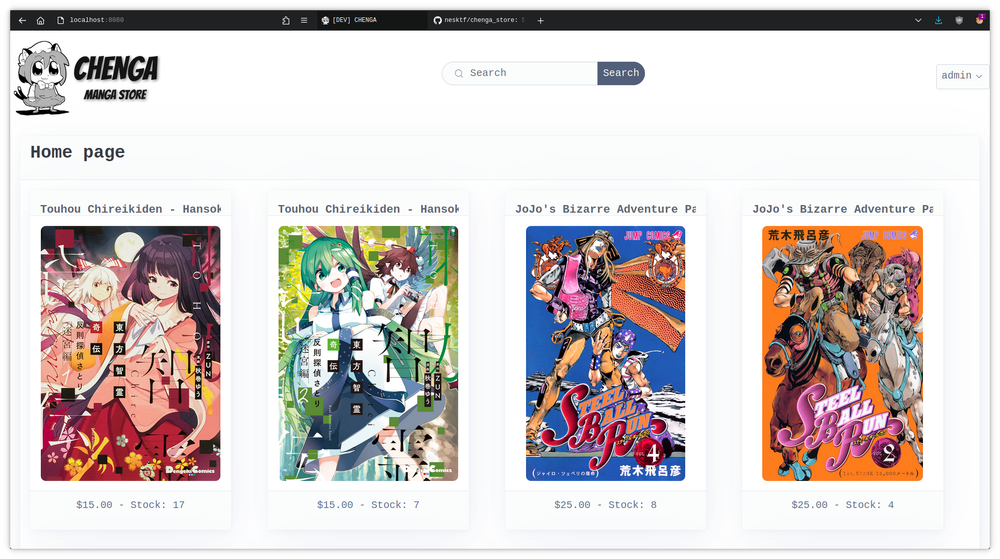
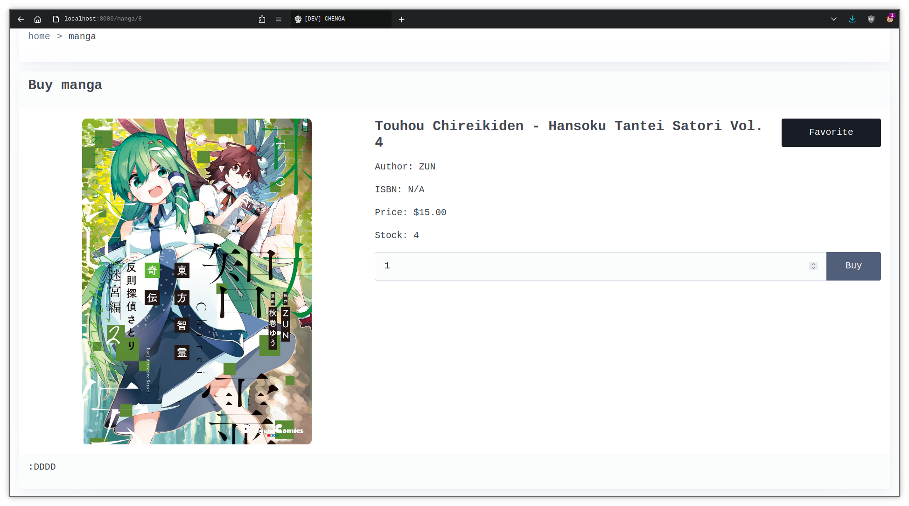

<div align="center">
    <picture>
        <source
            media="(prefers-color-scheme: dark)"
            srcset="app/static/logo_dark.png" />
        <source
            media="(prefers-color-scheme: light), (prefers-color-scheme: no-preference)"
            srcset="app/static/logo_light.png" />
        
    </picture>
</div>

# Chenga
Simple manga e-commerce I made for a college project. Writen in Lua, using 
[lapis](https://github.com/leafo/lapis),
[htmx](https://github.com/bigskysoftware/htmx),
and [picocss](https://github.com/picocss/pico).

## Installing
Tested on Debian 12 Bookworm and Arch Linux, but it should work fine on other distros.

First you need to install openresty, LuaJIT and luarocks. Follow the installation instructions from
[openresty's installation page](https://openresty.org/en/installation.html) or install it from
your package manager if it's available.

You need to install the following dependencies from luarocks:
```sh
luarocks install lapis lua-cjson bcrpyt tableshape bit lpeg --local --lua-version=5.1
```

For the database you have two options, either run PostgreSQL locally and create the user
and database specified in `config.lua`, or just use docker with the provided `docker-compose.yml`

Lastly, you have to define a secret in the `data/secret.lua` file. It just has to return
a string that will be used as a secret token, like the following:
```lua
-- data/secret.lua
return "myfunnysecrethehehaha"
```

## Running
Run one of the following commands (don't forget to load your luarocks environment):
```sh
lapis server development # to run in dev mode
lapis server production # to run in production mode
```

The website runs on port 8080 by default.

## Images
### Home page

### Details page

### Dashboard
 

