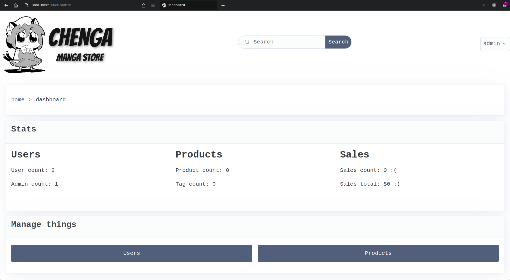

<div align="center">
    <picture>
        <source
            media="(prefers-color-scheme: dark)"
            srcset="app/static/logo_dark.png" />
        <source
            media="(prefers-color-scheme: light), (prefers-color-scheme: no-preference)"
            srcset="app/static/logo_light.png" />
        
    </picture>
</div>

# Chenga
Simple manga e-commerce I made for a college project. Writen in Lua, using 
[lapis](https://github.com/leafo/lapis),
[htmx](https://github.com/bigskysoftware/htmx),
and [picocss](https://github.com/picocss/pico).

## Installing
Only tested on Debian 12 Bookworm, should work fine in other distros.
May or may not run on Windows.

Install PostgreSQL, Luarocks and Lua5.1/LuaJIT using your system package manager, then download
the luarocks dependencies.
```sh
sudo apt install postgresql postgresql-contrib luarocks liblua5.1-dev libluajit-5.1-dev
luarocks install lapis lua-cjson bcrpyt tableshape bit lpeg --local --lua-version=5.1
```

Additionaly, you have to install openresty. Follow the installation instructions in
[openresty's installation page](https://openresty.org/en/installation.html).

## Settings
You can modify the project settings in `app/config.lua`.

By default, PostgreSQL should be running in port 5432, have an `ecommerce` database and set
the password as `password` for user `postgres`. The queries in `sql_init.sql` can be used to create the database.

You also need to add a `data/secret.lua` file, it should return a string to be
used as a secret token.
```lua
-- data/secret.lua
return "myfunnysecrethehehaha"
```

## Running
Go inside the `app/` folder and run one of the following commands (don't forget to load your
luarocks environment):
```sh
lapis server development # to run in dev mode
lapis server production # to run in production mode
```

The website runs on port 8080 by default.

## Images
### Dashboard
 

